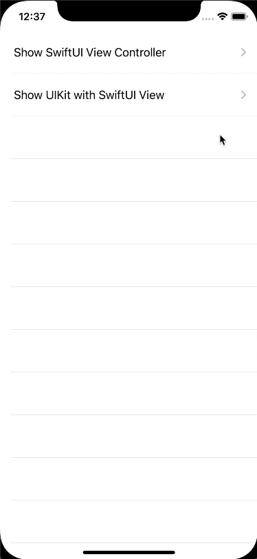

# UIKitWithSwiftUIExperiment
Experimenting how SwiftUI can be integrated into a UIKit application

# Exercises:

## Part 1 - Showing a SwiftUI View in UIKit

#### Getting Started
- Checkout `master` branch as the starting point

#### End Result
- By the end, you should be able to tap the table view cells to show the `LoginView` fullscreen, or show `LoginView` within a container view

#### Tasks
- [ ] Add SwiftUI `LoginView` with three UI components: Username field, Password field, and a Login button. It doesn't have to be fully styled.
- [ ] Add a way for the `LoginView` to let UIKit know that the Login button was pressed
- [ ] Wire up the "Show SwiftUI View Controller" table cell segue to show the SwiftUI `LoginView` full screen
- [ ] Show the `LoginView` within the Container View of the `SwiftUIContainerViewController`, so that the `LoginView` is laid out in the center of the container view.

#### Solution

- Solution to this part of the exercise is on the branch `checkpoint-1-done-swiftui-container-view`

## Part 2 - Adding a Login View Model

Also how to communicate a SwiftUI view's size back to UIKit so that container views can be sized appropriately.

#### Getting Started
- Check out `checkpoint-1-done-swiftui-container-view` branch as the starting point
- Review Combine framework
- Get familiar with `ObservableObject` protocol, ways for objects to be listened to in SwiftUI (`@ObservedObject`, `@StateObject`, `@EnvironmentObject`), and within those objects how to have properties to publish changes (`@Published`)

#### End Result
- By the end, you will have a `LoginViewModel` with form validation where the button will not be enabled unless the login form is valid (e.g. username and password are not empty)
- In addition, the `UIHostingController` view will be sized exactly as the size of the SwiftUI `LoginView`

#### Tasks
- [ ] Add a `LoginViewModel` which will drive the outputs of `LoginView`. Make the Login button disabled until username and password fields are not empty and handle the Login button press
- [ ] Change the size of the container view so that it matches the size of the SwiftUI `LoginView` exactly (Hint: Uses `GeometryReader` https://stackoverflow.com/questions/56573373/swiftui-get-size-of-child)

#### Solution

- Solution to this part of the exercise is on the branch `checkpoint-2-done-login-viewmodel`

## Part 3 - Adding a Forgot Password View

Also adding additional labels for when the password doesn't meet criteria and when the username ad password are incorrect.

#### Getting Started
- Check out `checkpoint-2-done-login-viewmodel` branch as the starting point
- Read up on the SwiftUI environment property `presentationMode` as that is used to dismiss SwiftUI views

#### End Result
- Login view has additional labels for errors
- A new view for user to submit their email for password reset (no email actually gets sent)
- Email form does validation to ensure that it's (somewhat) valid
- Submit button dismisses the forgot password view
- Tapping the close button dismisses the forgot password view

#### Tasks
- [ ] Add a new `Text` that shows up above the password field when password is empty
- [ ] Add a new `Text` that shows up after tapping Login if the username and password are incorrect
  - [ ] Add new logic in the `LoginViewModel` to check for a specific username/password
- [ ] Add new `ForgotPasswordView`
  - [ ] Has a close button (X) at the top left
  - [ ] Has title and description
  - [ ] Has an email text field
  - [ ] Button to submit form
- [ ] Add new `ForgotPasswordViewModel`
  - [ ] Does form validation
  - [ ] Has a function to handle submit button

#### Solution

- Solution to this part of the exercise is on the branch `checkpoint-3-done-forget-password`

